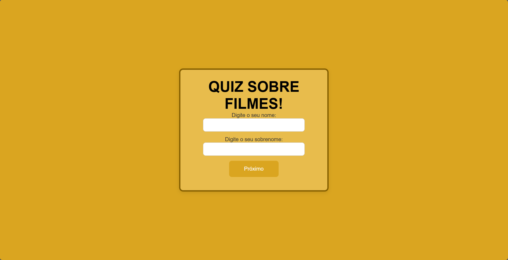
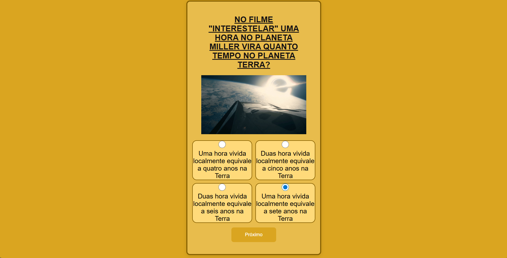

# 🎬 Quiz de Filmes  

Um site de **Quiz sobre Filmes** desenvolvido com **PHP** e **CSS**, rodando em servidor local com **XAMPP**.  
O projeto foi feito para praticar **lógica de programação**, **formulários em PHP** e **estilização com CSS**.  

---

## 🚀 Tecnologias Utilizadas

  
  

---

## 📌 Funcionalidades
- Perguntas e respostas sobre filmes 🎥  
- Feedback de acertos e erros ✅❌  
- porcentagem de pontuação 🏆  
- Tela de resultado final  

---

## 📷 Prints do Projeto

  
  
  

---

## ⚙️ Como rodar o projeto

1. Baixe e instale o [XAMPP](https://www.apachefriends.org/).  
2. Copie o projeto para a pasta `htdocs` dentro da instalação do XAMPP.  
3. Inicie o **Apache** no painel do XAMPP.  
4. Acesse no navegador: